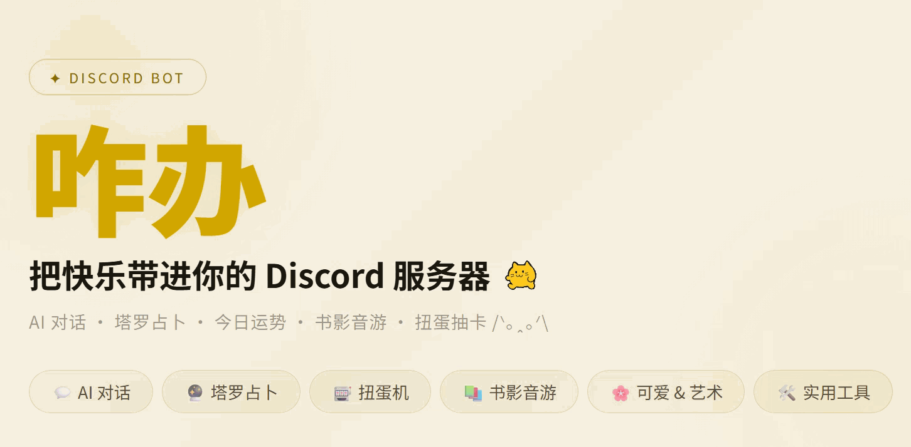

# 咋办Bot 官网 /ᐠ｡ꞈ｡ᐟ\



咋办（Zaban / ザバンにゃん）是一只住在 Discord 里的小黄猫 Bot —— 关注我，每天也学不到什么知识。

这个仓库是它的官网（GitHub Pages）：**https://sanjuroku.github.io/zabanbot/**

## 链接

- 🐱 [邀请咋办进服务器](https://discord.com/oauth2/authorize?client_id=1247835257189957673&permissions=277025770560&scope=bot+applications.commands)
- ⭐ [在 Top.gg 投票](https://top.gg/bot/1247835257189957673)
- ☕ [Ko-fi 投喂](https://ko-fi.com/G2G11H5VMC)

## 它会什么

AI 对话、塔罗占卜、今日运势（签到攒咋办币）、扭蛋机、书影音游检索、
颜文字 / 表情包等可爱功能、汇率时区等实用工具，支持中文（简/繁）/ English / 日本語。

在频道里喊一声「咋办」就会回应；斜杠命令从 `/help` 开始探索。

## 仓库结构

```
index.html        官网主页（单文件:样式、四语文案、彩蛋脚本都在里面）
privacy.html      隐私政策
tos.html          服务条款
screenshots/      官网用到的图片素材(hero 对话动图、功能截图、欢迎页等)
zabanbanner.gif   宣传横幅(由官网 hero 实录生成)
zabanwalk.gif     走路的咋办本办
```

网站是纯静态页面，无构建步骤——改完 `index.html` 推送即上线。

## 彩蛋

官网里藏了一些猫：光标是猫、点按钮会蹦猫、连点猫会下猫雨。请自行考古喵。
